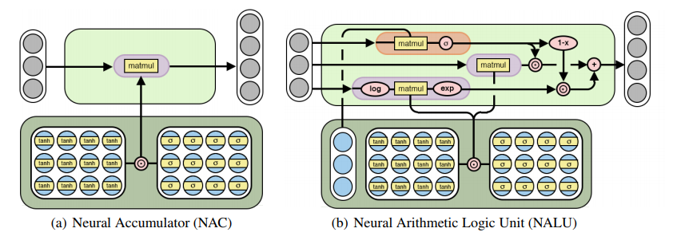

# NALU-Keras
A keras implementation of [Neural Arithmetic Logic Units](https://arxiv.org/pdf/1808.00508.pdf) by Andrew et. al.

While neural networks can successfully represent and manipulate numerical quantities given an
appropriate learning signal, the behavior that they learn does not generally exhibit systematic generalization. Specifically, one frequently observes failures when quantities that lie outside the
numerical range used during training are encountered at test time, even when the target function
is simple (e.g., it depends only on aggregating counts or linear extrapolation). This failure pattern
indicates that the learned behavior is better characterized by memorization than by systematic abstraction.
Whether input distribution shifts that trigger extrapolation failures are of practical concern
depends on the environments where the trained models will operate.

In this paper, a new module is proposed that can be used in conjunction with standard neural network
architectures (e.g., LSTMs or convnets) but which is biased to learn systematic numerical computation.
Our strategy is to represent numerical quantities as individual neurons without a nonlinearity.y. To these
single-value neurons, operators that are capable of representing simple functions (e.g., +,
−, ×, etc.) are applied. These operators are controlled by parameters which determine the inputs and operations
used to create each output. However, despite this combinatorial character, they are differentiable,
making it possible to learn them with backpropagation. 



The NALU consists of two NAC cells (the purple cells) interpolated by a learned sigmoidal gate
g (the orange cell), such that if the add/subtract subcell’s output value is applied with a weight of
1 (on), the multiply/divide subcell’s is 0 (off) and vice versa. The first NAC (the smaller purple
subcell) computes the accumulation vector a, which stores results of the NALU’s addition/subtraction
operations; it is computed identically to the original NAC, (i.e., a = Wx). The second NAC (the
larger purple subcell) operates in log space and is therefore capable of learning to multiply and divide,
storing its results in m:
```
NAC : a = Wx                      W = tanh(Wˆ )  σ(Mˆ )
NALU:  y = g  a + (1 − g)  m    m = expW(log(|x| + )), g = σ(Gx)
```
